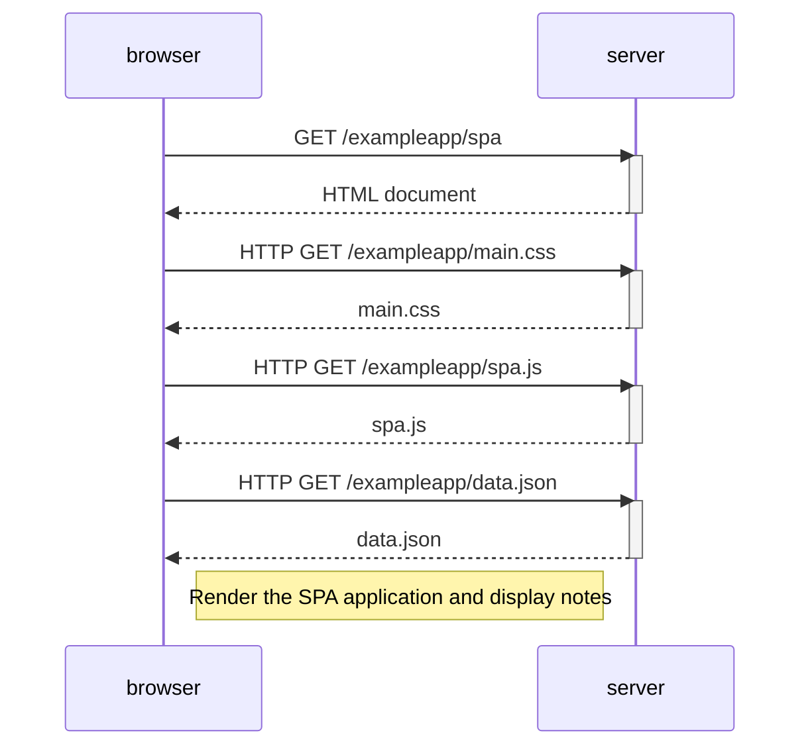

```mermaid
sequenceDiagram
    participant browser
    participant server

    browser->>server: GET /exampleapp/spa
    activate server
    server-->>browser: HTML document 
    deactivate server

    browser->>server: HTTP GET /exampleapp/main.css
    activate server
    server-->>browser: main.css
    deactivate server

    browser->>server: HTTP GET /exampleapp/spa.js
    activate server
    server-->>browser: spa.js
    deactivate server

    browser->>server: HTTP GET /exampleapp/data.json
    activate server
    server-->>browser: data.json
    deactivate server

    Note right of browser: Render the SPA application and display notes
```
